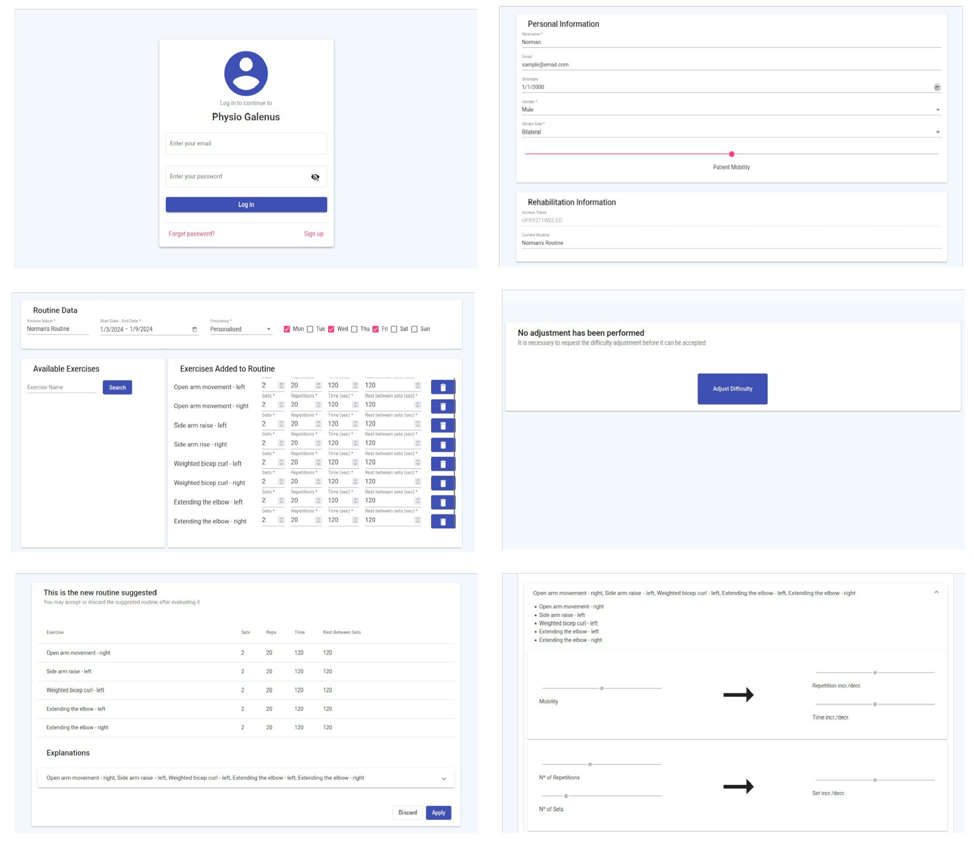
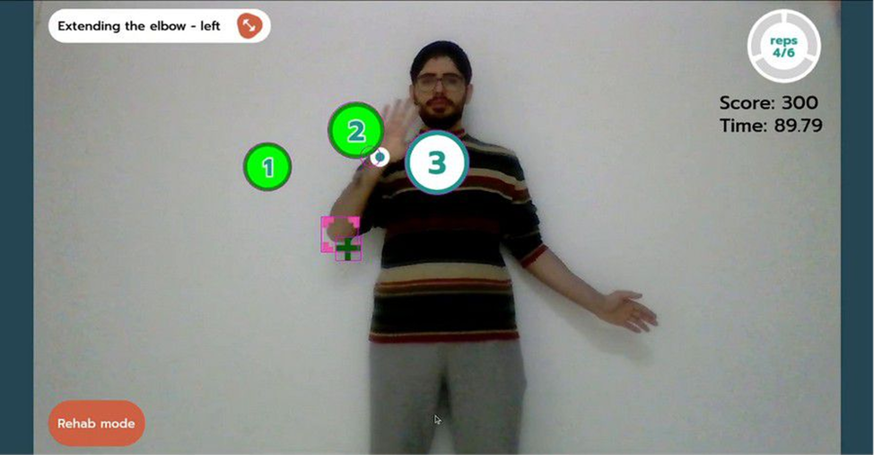
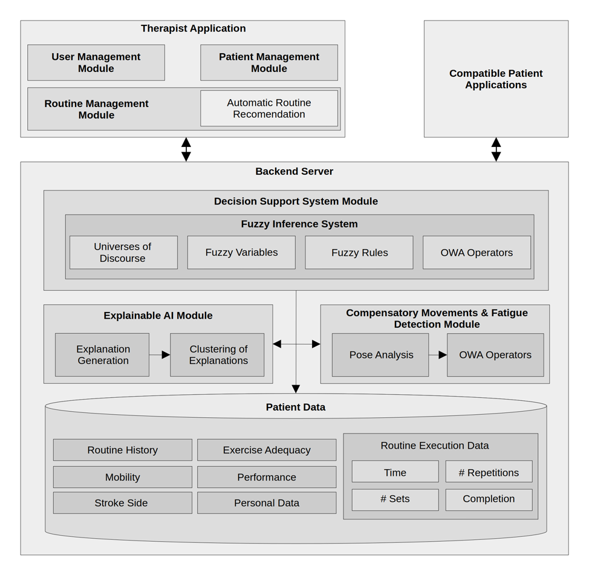

# Physio Galenus

Physio Galenus is a web-based physical therapy management platform. Therapists manage patients, create rehabilitation routines from exergame-based exercises, and track patient progress. The system includes a fuzzy-logic-based automatic difficulty adjustment engine (implemented in R) that analyzes patient execution data and recommends routine modifications. Designed for interoperability: external patient systems connect via a token-based API.





## Architecture Overview

Physio Galenus has a modular architecture with three major components:

* **Therapist Application:** Implemented in Angular, it enables therapists to manage patients and their routines. Additionally, it allows admin users to manage the system.
* **Backend Server:** Implemented using a RESTful architecture, the backend centralizes all execution data and provides an interface for patient applications. Its main responsibilities include:
  * **Decision Support System (DSS):** Uses a Mamdani-type Fuzzy Inference System (FIS) to recommend exercise adjustments based on recent patient performance, including metrics for fatigue and compensatory movements. Decisions are presented to therapists for validation, keeping them in the loop.
  * **Explainable AI Module:** Generates human-interpretable explanations for DSS recommendations, supporting clinical adoption and therapist trust.
  * **Detection Module:** Processes patient data, including pose analysis and other sensor inputs, to detect compensatory movements and fatigue levels.
* **Patient Applications:** External patient applications may interact with the backend server to receive routines and send captured execution data.



## Quick Setup

### Prerequisites

* Docker and Docker Compose.

### Steps

1\. Clone the repository:

```sh
git clone https://github.com/AIR-Research-Group-UCLM/Physio-Galenus
cd Physio-Galenus
```

2\. Copy the example environment file:

```sh
cp .env.example .env
```

The `.env` file is gitignored and contains all required configuration. See `.env.example` for the full list of variables:

| Variable | Required | Description |
| --- | --- | --- |
| `ORIGIN_URL` | Yes | Allowed CORS origins (comma-separated values) |
| `DATABASE_HOST` | Yes | PostgreSQL host |
| `DATABASE_PORT` | Yes | PostgreSQL port |
| `DATABASE_USERNAME` | Yes | PostgreSQL username |
| `DATABASE_PASSWORD` | Yes | PostgreSQL password |
| `DATABASE_DBNAME` | Yes | PostgreSQL database name |
| `COOKIE_SECRET` | Yes | Session cookie signing secret |
| `STATIC_API_KEY` | Yes | API key for external integrations |
| `DEMO_PASSWORD` | No | Password for the seed demo user |
| `DEMO_ACCESS_TOKEN` | No | Access token for the seed demo patient |

The defaults in `.env.example` are suitable for local Docker development. However, it is recommended to change the variables whose default value is `change-me`.

3\. Install the required dependencies:

```sh
make install
```

4\. Sync the schema to the database:

```sh
make db-schema-sync
```

5\. Start the application:

```sh
make start
```

See the Makefile for additional targets (migrations, documentation generation, etc.).

### Access Points

After startup, the application is available at:

* **Frontend**: <http://localhost:8081>
* **Backend API**: <http://localhost:8080>

## Test Credentials

* **Test therapist**: `test@test.com` / value of `DEMO_PASSWORD` from your `.env` file
* **Read-only demo user**: `demo@demo.com` / `202601SoftwareXDemoUser!`; has read-only access

## Related Publications

This project is part of the research conducted by the AIR Research Group at UCLM. It has been used as the basis for several publications, including:

* Gómez-Portes, C., Martínez, S., Schez-Sobrino, S., Herrera, V., Albusac, J. A., & Vallejo, D. (2024). An AI-Based Remote Rehabilitation System to Promote Access to Physical Rehabilitation. In *AI for People, Democratizing AI* (pp. 11–25). Springer Nature Switzerland. <https://doi.org/10.1007/978-3-031-71304-0_2>

* Martínez, S., Gómez-Portes, C., Herrera, V., Albusac, J., Castro-Schez, J. J., & Vallejo, D. (2023). Decision Support System for Automatic Adjustment of Rehabilitation Routines for Stroke Patients. In *HC@AIxIA* (pp. 52–66).

* Martínez-Cid, S., Vallejo, D., Herrera, V., Schez-Sobrino, S., Castro-Schez, J. J., & Albusac, J. A. (2025). Explainable AI-driven decision support system for personalizing rehabilitation routines in stroke recovery. *Progress in Artificial Intelligence*. <https://doi.org/10.1007/s13748-024-00357-6>

* Martinez-Cid, S., Essalhi, M., Herrera, V., Albusac, J., Schez-Sobrino, S., & Vallejo, D. (2025). An Adaptive Fatigue Detection Model for Virtual Reality-Based Physical Therapy. *Information*, *16*(2), 148. <https://doi.org/10.3390/info16020148>

## How to Cite

If you use Physio Galenus in your research, please cite the following article:

> Martínez-Cid, S., Herrera, V., Monekosso, D. N., Schez-Sobrino, S., Albusac, J., & Vallejo, D. (2026). Physio Galenus: a modular decision support platform for AI-supported physical rehabilitation. *SoftwareX*, *35*, 102781. <https://doi.org/10.1016/j.softx.2026.102781>

BibTeX:

```bibtex
@article{MartinezCid2026PhysioGalenus,
  title     = {Physio Galenus: a modular decision support platform for AI-supported physical rehabilitation},
  author    = {Mart{\'i}nez-Cid, Sergio and Herrera, Vanesa and Monekosso, Dorothy N. and Schez-Sobrino, Santiago and Albusac, Javier and Vallejo, David},
  journal   = {SoftwareX},
  volume    = {35},
  pages     = {102781},
  year      = {2026},
  issn      = {2352-7110},
  doi       = {10.1016/j.softx.2026.102781},
  url       = {https://doi.org/10.1016/j.softx.2026.102781},
  publisher = {Elsevier}
}
```
